# Menteea

<div align="center">

### Knowledge in Motion.

**An AI Research Operating System that transforms PDFs into grounded conversations, study guides, flashcards, quizzes, mind maps, and exportable knowledge artifacts.**


[Live Demo](#) • [Features](#features) • [Architecture](#architecture) • [Installation](#installation) • [Roadmap](#roadmap)

</div>

---

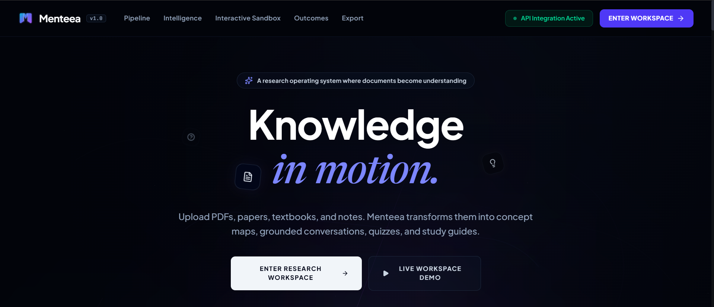

---

# What is Menteea?

Most AI tools answer questions.

Most PDF readers display documents.

**Menteea transforms documents into understanding.**

Upload textbooks, lecture notes, research papers, documentation, or technical references and convert them into an interactive knowledge workspace powered by Retrieval-Augmented Generation (RAG), semantic retrieval, AI-assisted learning, and intelligent knowledge synthesis.

Instead of forcing users to jump between multiple applications, Menteea unifies document reading, research, revision, assessment, and knowledge exploration into a single workspace.

---

# Core Workflow

```text
Upload Documents
        ↓
PDF Processing
        ↓
Semantic Retrieval
        ↓
Grounded AI Chat
        ↓
Personalized Revision Workspace
        ↓
Flashcards
        ↓
Interactive Quizzes
        ↓
Knowledge Maps
        ↓
Export & Revision
```

---

# Workspace

The central workspace combines document management, PDF reading, and grounded AI conversations.

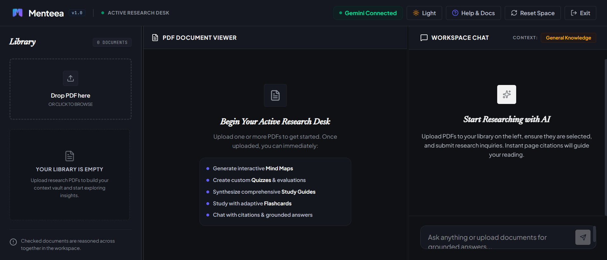

### Workspace Features

- Multi-document research environment
- Side-by-side PDF viewer
- Citation-grounded AI responses
- Follow-up research suggestions
- Persistent workspace state
- Dark & light themes
- Context-aware document selection

---

# AI Research Chat

Ask questions directly against your documents.

Menteea retrieves relevant document chunks, builds contextual prompts, and generates grounded answers with citations.

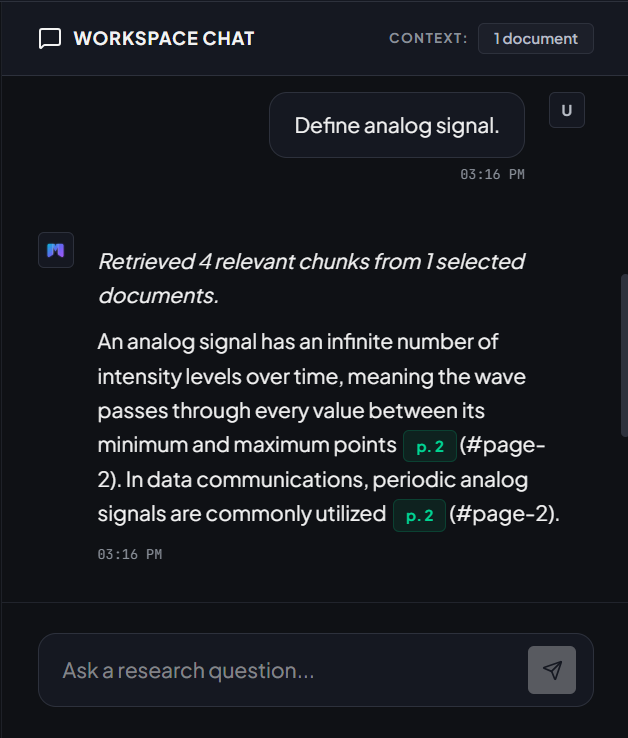

### Capabilities

- Retrieval-Augmented Generation (RAG)
- Citation-aware responses
- Multi-document reasoning
- Semantic retrieval
- Context-grounded answers
- Follow-up question generation

---

# Intelligent PDF Reading

Documents remain fully accessible while AI features operate on top of them.

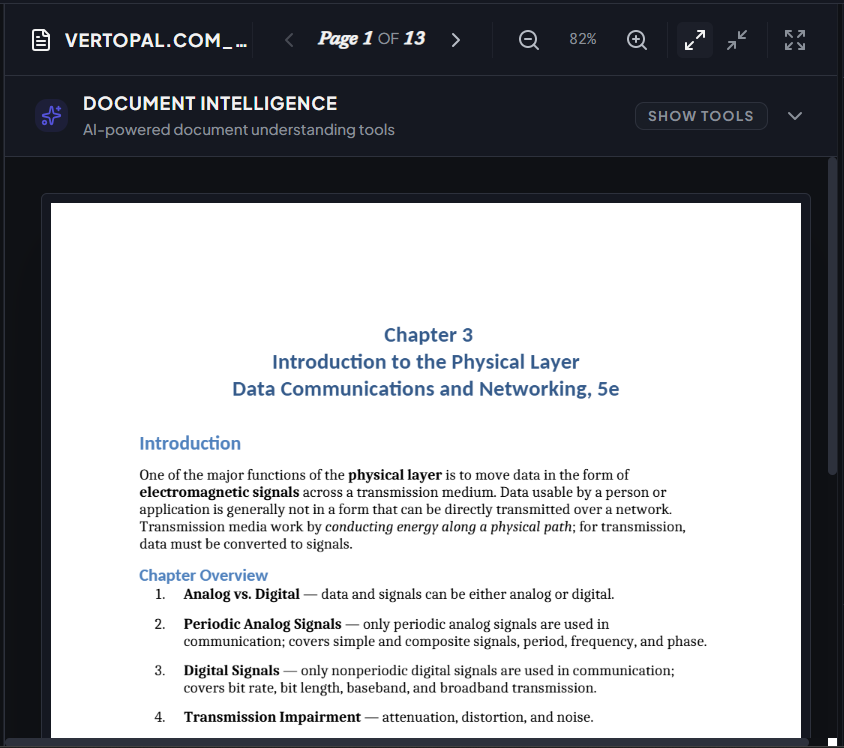

### Features

- Native PDF rendering
- Page navigation
- Zoom controls
- Fullscreen mode
- Reading-state persistence
- Multi-document support

---

# Personalized Revision Workspace

Transform dense academic material into structured revision content.

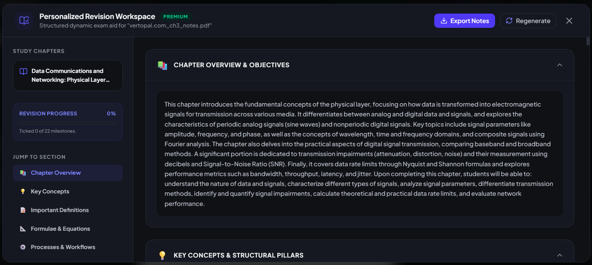

### Generated Learning Assets

- Chapter Overviews
- Key Concepts
- Important Definitions
- Formulae & Equations
- Processes & Workflows
- Revision Checklists
- Learning Milestones

---

# Interactive Flashcards

Convert document content into active recall exercises designed for retention and rapid revision.

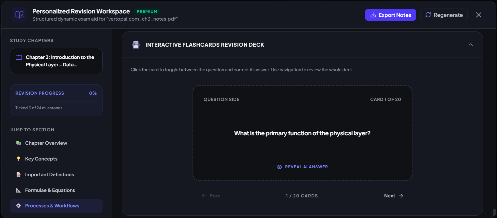

### Flashcard Features

- AI-generated flashcard decks
- Question / Answer mode
- Sequential review navigation
- Active recall learning
- Exam-focused revision
- Document-grounded content
- Integrated with Study Guides

---

# Interactive Knowledge Assessment

Generate document-specific quizzes instantly.

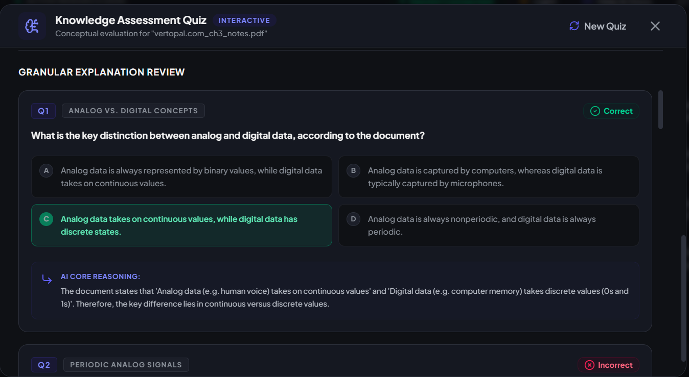

### Quiz Features

- AI-generated questions
- Topic categorization
- Answer explanations
- Performance analysis
- Knowledge gap detection
- Regeneration support

---

# Assessment Analytics

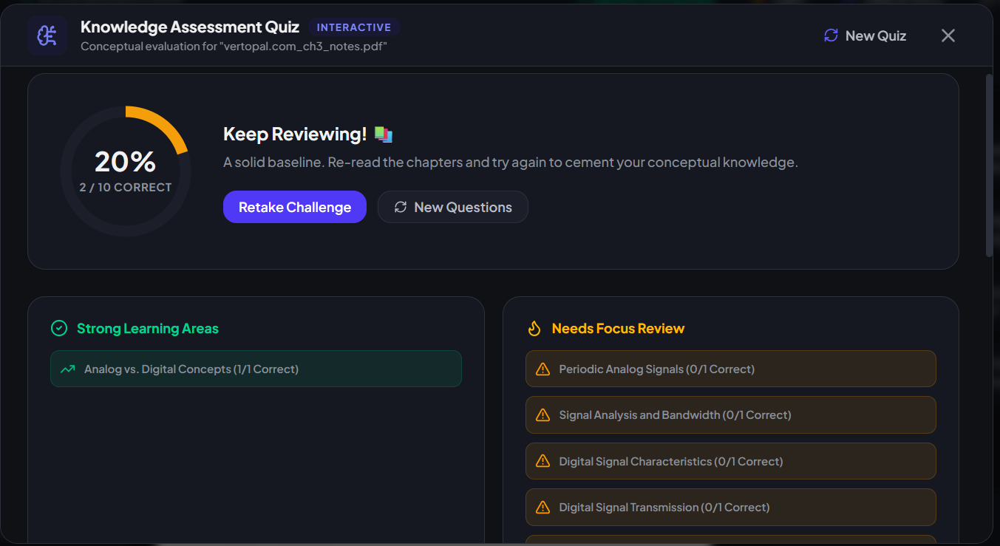

Users receive:

- Topic-level breakdowns
- Strong-area identification
- Weak-area detection
- Guided review recommendations
- Personalized learning feedback

---

# Knowledge Maps

Visualize how concepts connect across an entire document.

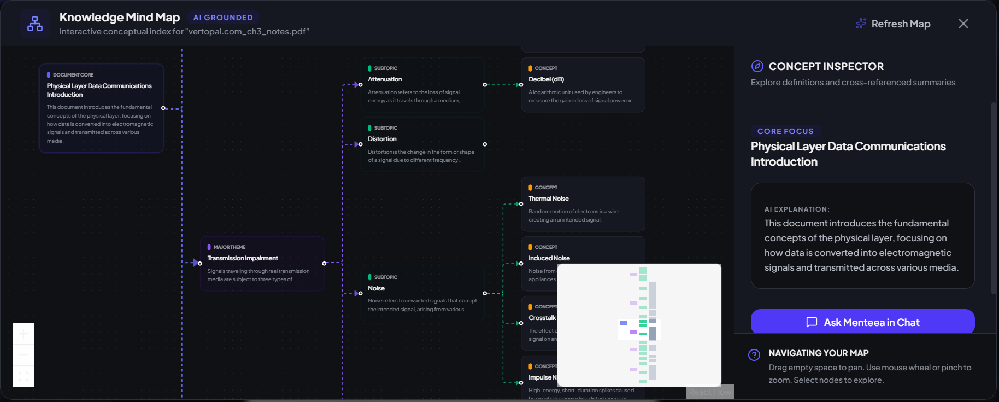

### Mind Map Features

- Interactive graph exploration
- Concept hierarchy visualization
- Cross-reference navigation
- AI-generated explanations
- Concept inspector
- Chat integration

---

# Multi-Document Reasoning

Menteea supports reasoning across multiple selected documents simultaneously.

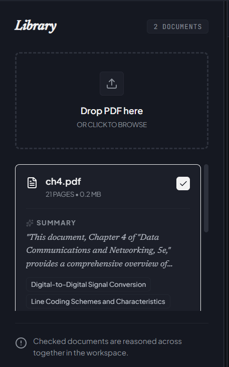

This enables:

- Cross-document comparisons
- Research synthesis
- Multi-source reasoning
- Unified contextual retrieval
- Better research workflows

---

# Export Center

Generated learning artifacts can be exported for offline use.

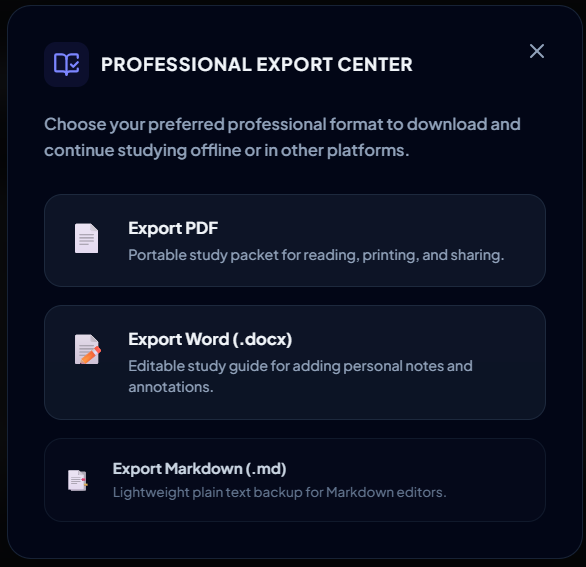

### Supported Formats

- PDF
- Microsoft Word (.docx)
- Markdown (.md)

---

# Features

### Research

- Grounded AI Chat
- Citation-based Answers
- Multi-Document Retrieval
- Semantic Search

### Learning

- Personalized Study Guides
- Flashcard Generation
- Interactive Quizzes
- Knowledge Assessment

### Knowledge Exploration

- Interactive Mind Maps
- Concept Relationships
- Knowledge Navigation

### Productivity

- Export System
- Workspace Persistence
- Dark & Light Themes
- Document Library

---

# Architecture

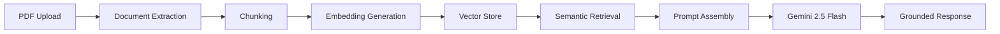

---

# System Architecture

```text
Frontend (React + TypeScript)
│
├── Library Panel
├── PDF Viewer
├── Workspace Chat
├── Study Guide Engine
├── Flashcard Engine
├── Quiz Engine
├── Mind Map Engine
└── Export Center

Backend (Node.js + Express)
│
├── ChatService
├── RetrievalService
├── DocumentService
├── EmbeddingService
└── VectorStore

AI Layer
│
├── Gemini 2.5 Flash
├── Semantic Retrieval
└── Grounded Generation
```

---

# Performance Optimizations

### SHA-256 Deduplication

Prevents duplicate document indexing.

### Retrieval Cache

Avoids repeated retrieval computations.

### Embedding Cache

Reuses previously generated embeddings.

### LRU Cache Management

Memory-safe bounded cache design.

### IndexedDB Persistence

Workspace survives refreshes and browser restarts.

### Smart Retrieval

Only the most relevant chunks are sent to the model.

---

# Security & Reliability

### Rate Limiting

| Endpoint    | Limit  |
| ----------- | ------ |
| Chat        | 60/min |
| Upload      | 10/min |
| Export      | 20/min |
| AI Features | 20/min |

### Defensive Controls

- Request validation
- Error boundaries
- Graceful AI failure handling
- Document size limits
- Page count limits
- Character extraction limits

### Reliability Features

- Persistent workspace state
- Retry handling
- Cache invalidation
- Recovery after refresh

---

# Tech Stack

### Frontend

- React
- TypeScript
- Vite
- Tailwind CSS
- IndexedDB

### Backend

- Node.js
- Express
- TypeScript

### AI

- Google Gemini 2.5 Flash
- Retrieval-Augmented Generation
- Semantic Search

### Document Processing

- PDF Parsing
- Text Extraction
- Chunking Pipeline

---

# Installation

## Clone Repository

```bash
git clone https://github.com/yourusername/menteea.git
cd menteea
```

## Install Dependencies

```bash
npm install
```

## Environment Variables

Create:

```bash
.env
```

Add:

```env
GEMINI_API_KEY=your_api_key_here
```

## Run Development Server

```bash
npm run dev
```

Application:

```text
http://localhost:5173
```

---

# Roadmap

## Completed

- Grounded AI Chat
- Multi-Document Retrieval
- PDF Viewer
- Study Guides
- Flashcards
- Interactive Quizzes
- Knowledge Maps
- Export Center
- Persistence Layer
- Retrieval Cache
- Embedding Cache
- SHA-256 Deduplication

## Planned

- Research Notebook
- Citation Explorer
- Flashcard Scheduling
- Research Collections
- Collaborative Workspaces
- Knowledge Graph Expansion
- Linked Document Networks

---

# Why Menteea?

Most educational AI tools focus on generating answers.

Menteea focuses on building understanding.

The objective is not simply to respond to questions, but to help learners, researchers, and professionals transform static documents into interactive knowledge systems that can be explored, studied, assessed, and retained.

---

# Author

**Arman Mahapatra**

Computer Science & Engineering
National Institute of Technology Silchar

---

# License

MIT License

---

<div align="center">

### Knowledge in Motion.

Transform documents into understanding.

</div>
